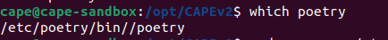
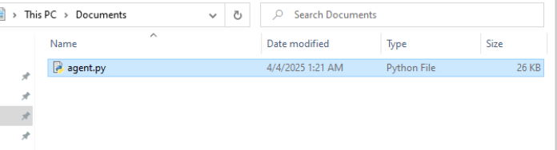

# CAPEv2 Sandbox Installation from Begin

This repository provides an automated script for installing and configuring CAPE Sandbox.  
I used this sandbox as part of my thesis to extract network traffic.  
This repository also includes a documentation of errors encountered during the installation process, serving as a guide for others who might face similar issues.

## What is CAPEv2

CAPE Sandbox is an Open Source software for automating analysis of suspicious files.  
To do so it makes use of custom components that monitor the behavior of the malicious processes while running in an isolated environment.

## Prepare Requirement

For installing CAPEv2 I used nested virtualization format.  
At first, I used Ubuntu 22.04.4 as my base operating system and faced errors, so I decided to use nested virtualization.

For installing you can follow this path:

```bash
sudo apt-get update && sudo apt-get upgrade -y
sudo chmod -R a+rwx /opt/
cd /opt
sudo apt install git
git clone https://github.com/kevoreilly/CAPEv2.git
cd CAPEv2/installer
sed -i 's/<WOOT>/BXPC/g' kvm-qemu.sh
chmod a+x kvm-qemu.sh
chmod a+x cape2.sh
```bash
sudo ./kvm-qemu.sh all cape | tee kvm-qemu.log
sudo reboot

cd /opt/CAPEv2/installer
sudo ./kvm-qemu.sh virtmanager cape | tee kvm-qemu-virt-manager.log
after that you have see :

```bash
cd /opt/CAPEv2/installer
sudo ./cape2.sh all cape | tee cape.log
sudo reboot

cd /opt/CAPEv2
poetry install or sudo poetry install
if you see such result from this command :

check this :

then do like this:

```bash
poetry env list
---- poetry run pip install -r requirements.txt -------
sudo -u cape poetry run pip install -r extra/optional_dependencies.txt
sudo -u cape poetry run pip install pyattck==7.1.2
-----------------------------
cd /opt/CAPEv2
sudo apt install dbus-x11
in this part have to check these:

for checking how does do setting conf file can check here https://capev2.readthedocs.io/en/latest/installation/host/configuration.html
after set the conf files you can check cape web UI


now for target side you have to install windows 10 on your KVM:
before that sure to check:

then select new virtual machine and start installation 

after the installation finish 
download python #python must be x32 version (windows 7 version 3.7.0) ( windows 10 version 3.10.6)
- Create 2-4 files and docs in Desktop (to make the vm looks like reality)
you have to copy agent file from your cape in your windows in host do like this

then in browser in windows enter your vm ip:8000
then open agent file copy it in document

after that you have to set aget file pop up when windows start


now install what mention
- python -m pip install Pillow==9.5.0
- Download and install OfficeSetup.exe (if you have a license) 
- Download pdf reader
- Download .NET Framwork (3.5 win7 4.8 win10-11)
- Download 7z for windows 10-11 and 7 winrar

after that 
- disable anti-virus
- disable auto update
- disable firewall


